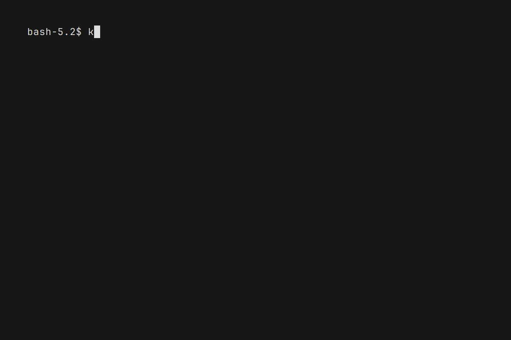

# KongVisor


[](https://github.com/mchlumsky/kongvisor/releases/latest)
[](https://codecov.io/gh/mchlumsky/kongvisor)
[](/LICENSE)
[](https://github.com/mchlumsky/kongvisor/actions?workflow=build)
[](https://github.com/goreleaser)
[](https://www.buymeacoffee.com/martinchlumsky)

KongVisor is a TUI for [Kong](https://konghq.com/) [Gateway Admin API](https://developer.konghq.com/api/gateway/admin-ee/3.11/).

It supports managing Kong Gateway resources like Workspaces, Services, Routes, and Plugins in a terminal user interface.

KongVisor is tested with Kong Enterprise versions 3.0, 3.1, 3.2, 3.3, 3.4, 3.5, 3.6, 3.7, 3.8, 3.9, 3.10 and 3.11 and Kong OSS versions 3.0, 3.1, 3.2, 3.3, 3.4, 3.5, 3.6, 3.7, 3.8 and 3.9.

## Demo

### Listing resources

List resources (workspaces, services, routes, plugins). To see services in a workspace, scroll down to the workspace and press "s". To see routes in a service, scroll down to the service and press "r". To see plugins in a workspace, service or route, scroll down to the workspace, service or route and press "p".


### Viewing resources

View resource details (in YAML of course!). Scroll down to the resource you want to see and press "y". Press esc to go back.


### Deleting resources

Delete resources (**without** confirmation). Scroll down to the resource you want to delete and press "Ctrl-d".



### Editing resources

Edit resources (in your favorite editor defined by the `$EDITOR` environment variable). Scroll down to the resource you want to edit and press "e".


### Clearing filters

Let's say you have filtered the list of plugins by service and route like this:

```Workspace[default] > Service[foo] > Route[firstFoo] > Plugins ```

If you want to see plugins applied to the service, then you can clear the route filtering by pressing capital `R` which will result in:

```Workspace[default] > Service[foo] > Plugins```

In the same fashion, you can clear the service and workspace filters by pressing capital `S` and capital `W` respectively.

## Installation

### YUM/DNF repository (Fedora, CentOS, etc...)

To enable, add the following file /etc/yum.repos.d/mchlumsky.repo:

```
[mchlumsky]
name=mchlumsky repository (kongvisor, etc...)
baseurl=https://yum.fury.io/mchlumsky/
enabled=1
gpgcheck=0
```

and

```shell
dnf install kongvisor
# or
yum install kongvisor
```

### APT/DEB repository (Debian, Ubuntu, etc...)

To enable, add the following file /etc/apt/sources.list.d/mchlumsky.list:

```
deb [trusted=yes] https://apt.fury.io/mchlumsky/ /
```

and

```shell
apt update
apt install kongvisor
```

### Zypper repository (OpenSUSE)

To enable, run the following command:

```shell
zypper addrepo --no-gpgcheck https://yum.fury.io/mchlumsky/ mchlumsky
zypper install kongvisor
```

### Binary Releases

Download and install a prebuilt binary from [github releases](https://github.com/mchlumsky/kongvisor/releases)

### From source

Install from source:

```bash
go install github.com/mchlumsky/kongvisor@latest
```

## Configuration

KongVisor supports multiple Kong Gateways, each with its own configuration.

It will read this file to find the Kong Gateway Admin API URLs and tokens.

Configuration goes into `$HOME/.config/kongvisor/config.yaml`.

Example configuration:

```yaml
kong-gateway-1: # name of a kong gateway
  url: http://kong-gateway-1.domain:8001 # Kong Admin API URL
  kongAdminToken: secret-token # Kong Admin API token
kong-gateway-2:
  url: http://kong-gateway-2.domain:8001
  kongAdminToken: other-secret-token

```

## Usage

Run KongVisor with the name of the Kong Gateway you want to manage:

```bash
kongvisor kong-gateway-1
```
